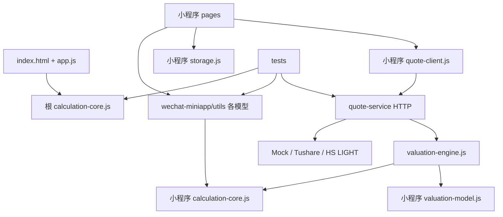

# 《退了吗》后续工作战略规划报告

> 审计日期：2026-06-24  
> 审计范围：`wealth-freedom-demo/` 当前工作树（含未提交文件、被忽略的本地运行文件，不含 `.git/` 内部对象）  
> 本报告只规划后续工作，不执行目录迁移、公式修改或删除操作。

## 1. 当前项目阶段判断

《退了吗》已经完成“本地可运行 MVP”，但尚未完成“可真实验收的小程序产品”。当前最准确的阶段是：**工程整理期与微信真机验证期之间**。

| 维度 | 当前状态 | 判断 |
| --- | --- | --- |
| Web Demo | 静态页面可运行，具备资产、保障、路线、拖累项、OCR Mock、行情 Mock | 功能闭环已形成，但单文件技术债明显 |
| 微信小程序 | 6 个页面、5 个 tab、本地存储、页面模型和页面冒烟测试齐备 | 已达到开发者工具导入前的本地基线 |
| 计算模型 | Web 和小程序各有一份计算核心 | 当前结果一致，但存在持续漂移风险 |
| quote-service | 本地 Node HTTP 服务、Provider 适配、估值快照、本地文件存储 | 是接口原型，不是生产后端 |
| 自动化测试 | `node --test tests/*.test.js` 共 80 项通过 | 本地回归基础较好，缺少真机、跨端一致性和生产集成测试 |
| 小程序预检 | 静态校验、JS/JSON 语法和自动化测试均通过 | 微信开发者工具 CLI 未找到，真实导入和真机尚未完成 |
| 数据 | Web 使用多个 `localStorage` key；小程序使用单一 `wx` storage state | 只适合本地单设备 MVP |
| 行情 | Mock、Tushare 和恒生 LIGHT 适配骨架存在 | 授权、合法展示、缓存、限频尚未闭环 |
| 合规 | 有隐私与免责声明草案和小程序页面 | 尚非可上线版本，需真实流程验收和法务确认 |

**阶段结论：** 当前应停止横向堆功能，先完成 P0 工程整理和微信真机验证。生产后端、真实行情、iOS 原生化都不是当前瓶颈。

## 2. 当前文件结构梳理

### 2.1 规模概览

- 根目录静态 Web：`app.js` 2,009 行 / 80 KB，`styles.css` 2,510 行 / 43 KB，`index.html` 552 行 / 25 KB。
- 计算核心：根目录 446 行；小程序副本 451 行。
- 微信小程序：66 个文件，约 1.58 MB，其中未引用的 `app-avatar.png` 单文件约 1.40 MB。
- tests：11 个测试文件，80 个测试用例全部通过。
- `.runtime/`：19 个本地运行文件，约 54.35 MB，主要体积来自 `cloudflared.exe`。
- 当前工作树有大量用户未提交修改。本报告不覆盖、不回滚这些修改。

### 2.2 当前文件树

```text
wealth-freedom-demo/
├── .gitignore
├── README.md
├── PROJECT_PLAN.md
├── index.html
├── styles.css
├── app.js
├── calculation-core.js
├── phone.html
├── mobile-preview.html
├── start-demo.ps1
├── dev-static-server.py
├── 退了吗项目技术拆解报告_2026-06-24.docx      # 未跟踪二进制报告
├── .runtime/                                    # 已忽略
│   ├── cloudflared.exe
│   ├── cloudflared.log
│   ├── dev-static-server.pid
│   ├── dev-static-server.log
│   ├── dev-server-{8000,8765,8766,8767}.{out,err}.log
│   ├── server.{out,err}.log
│   └── mobile-{overview,assets,security,route,drags}-20260608.png
├── quote-service/
│   ├── README.md
│   ├── server.js
│   ├── mock-quotes.js
│   ├── valuation-engine.js
│   ├── valuation-store.js
│   └── providers/
│       ├── provider-contract.md
│       ├── provider-registry.js
│       ├── mock-provider.js
│       ├── real-provider-placeholder.js
│       ├── tushare-provider.js
│       └── hs-light-provider.js                 # 未跟踪
├── scripts/
│   ├── validate-miniapp.js
│   ├── wechat-miniapp-preflight.ps1
│   ├── init-miniapp-private-config.ps1
│   ├── probe-tushare-access.js                  # 未跟踪
│   └── generate-miniapp-icons.py
├── tests/
│   ├── calculation-core.test.js
│   ├── ui-static.test.js
│   ├── ocr-flow-static.test.js
│   ├── security-static.test.js
│   ├── wechat-miniapp.test.js
│   ├── wechat-miniapp-page-smoke.test.js
│   ├── quote-client.test.js
│   ├── valuation-model.test.js
│   ├── quote-provider.test.js
│   ├── quote-service.test.js
│   └── tushare-access-probe.test.js             # 未跟踪
├── docs/
│   ├── project-summary-report.md                # 未跟踪
│   ├── wechat-miniapp-development.md
│   ├── wechat-miniapp-acceptance-checklist.md
│   ├── wechat-mvp-data-model.md
│   ├── privacy-and-disclaimer-draft.md
│   ├── quote-valuation-architecture.md
│   ├── daily-valuation-architecture.md
│   ├── next-quote-api-plan.md
│   ├── real-provider-selection.md
│   ├── api-provider-selection-phase-12.md        # 未跟踪
│   └── ai-workflows/
│       └── quote-api-integration.workflow.json
└── wechat-miniapp/
    ├── app.js
    ├── app.json
    ├── app.wxss
    ├── sitemap.json
    ├── project.config.json
    ├── project.private.config.example.json
    ├── project.private.config.json               # 本地真实配置，已忽略
    ├── minitest/
    │   └── test.config.json                      # 空 treeData，占位状态
    ├── assets/
    │   ├── app-avatar.png                        # 未跟踪、当前未发现引用
    │   └── tab-{overview,assets,security,route,drags}[-active].png
    ├── components/
    │   ├── asset-item/asset-item.{js,json,wxml,wxss}
    │   ├── metric-card/metric-card.{js,json,wxml,wxss}
    │   └── section-card/section-card.{js,json,wxml,wxss}
    ├── pages/
    │   ├── overview/overview.{js,json,wxml,wxss}
    │   ├── assets/assets.{js,json,wxml,wxss}
    │   ├── security/security.{js,json,wxml,wxss}
    │   ├── route/route.{js,json,wxml,wxss}
    │   ├── drags/drags.{js,json,wxml,wxss}
    │   └── legal/legal.{js,json,wxml,wxss}
    └── utils/
        ├── calculation-core.js
        ├── storage.js
        ├── demo-data.js
        ├── format.js
        ├── asset-model.js
        ├── security-model.js
        ├── route-model.js
        ├── drag-model.js
        ├── overview-model.js
        ├── quote-client.js
        └── valuation-model.js
```

### 2.3 目录职责

| 路径 | 当前职责 | 评价 |
| --- | --- | --- |
| 根目录 | Web Demo、计算核心、启动工具、项目入口文档混放 | 职责过多，应减负 |
| `wechat-miniapp/` | 小程序 UI、页面模型、存储、计算核心副本、行情客户端 | 可导入，但同时承担共享域逻辑 |
| `quote-service/` | 本地行情与估值接口、Provider 适配、本地快照 | 边界基本清楚，但反向依赖小程序目录 |
| `tests/` | core、Web、小程序、服务、安全检查全部平铺 | 命令简单，但扩展后难维护 |
| `docs/` | 产品、架构、合规、Provider 调研、阶段计划混放 | 已出现版本重叠和结论入口不唯一 |
| `scripts/` | 小程序校验、预检、私有配置、Provider 探测、图标生成 | 职责合理，可按 dev/ci/provider 再分组 |
| `.runtime/` | PID、日志、截图、快照、隧道二进制 | 已正确忽略，但需清理策略 |

### 2.4 关键文件职责

| 文件 | 职责 | 主要依赖/消费者 | 问题 |
| --- | --- | --- | --- |
| `index.html` | Web 页面结构和全部业务区块容器 | `styles.css`、根 `calculation-core.js`、`app.js` | 552 行，页面边界仅靠 DOM id |
| `app.js` | 状态、存储、表单、OCR Mock、行情 Mock、计算调用、DOM 渲染、事件绑定、手机预览 | `window.WealthCalculation`、浏览器 DOM | 2,009 行，职责高度耦合 |
| `styles.css` | Web 全部桌面、移动、预览样式 | `index.html` | 2,510 行，组件边界弱 |
| 根 `calculation-core.js` | Web 计算、持仓归一化、模拟、保障支持、拖累影响 | Web、根 core 测试 | 与小程序存在副本 |
| `wechat-miniapp/utils/calculation-core.js` | 小程序兼容版计算核心 | 小程序模型、quote-service、miniapp 测试 | 实际成为后端共享依赖，目录边界错误 |
| `wechat-miniapp/utils/storage.js` | 小程序单 key 状态持久化和迁移 | 所有小程序页面 | 无 schema version 迁移注册表 |
| `asset-model.js` | 资产表单、持仓装饰、行情刷新、OCR Mock | 资产页 | 同时含领域逻辑和 UI 文案 |
| `overview-model.js` | 聚合状态并调用退休模拟 | 总览、路线、拖累、保障页 | 是共享应用层模型，位置合理但依赖副本 core |
| `valuation-model.js` | 每日估值快照和总额变化 | 小程序资产页、quote-service | 目前只有总额差，无法解释变化归因 |
| `quote-client.js` | 小程序本地 Mock / 后端请求适配 | `asset-model.js` | localhost 默认值只能用于开发 |
| `quote-service/server.js` | 原生 Node HTTP 路由和错误响应 | 本地服务、service 测试 | 349 行尚可；无生产中间件能力 |
| `valuation-engine.js` | 调 Provider、应用价格、生成估值快照 | quote-service | 直接 require 小程序 utils，边界倒置 |
| `valuation-store.js` | `.runtime/valuation-snapshots.json` 本地文件存储 | quote-service | 仅限 Demo，不支持并发/备份/事务 |
| `provider-registry.js` | 根据环境选择 Mock/Tushare/HS LIGHT | quote-service | 模式清晰，但无集中配置校验 |
| `validate-miniapp.js` | 路径、JSON、引用、语法、网络、密钥、图标静态检查 | 预检脚本、miniapp 测试 | 应保留并随迁移更新 root 常量 |
| `wechat-miniapp-preflight.ps1` | 串联校验、测试、语法和 DevTools CLI 探测 | 人工验收前 | 当前 DevTools CLI 未找到 |
| `project.config.json` | 可提交的小程序项目配置 | 微信开发者工具 | 当前未提交修改把 `touristappid` 改成真实 AppID，和 private config 策略冲突 |
| `project.private.config.json` | 本地 AppID/开发者设置 | 本地微信开发者工具 | 已忽略，位置正确，不应移动或提交 |

### 2.5 依赖关系



最需要修复的是 `quote-service -> wechat-miniapp/utils`。服务端不应依赖某个 UI 应用目录；两者都应依赖 `packages/core` 和 `packages/valuation`。

### 2.6 重复、混乱和清理候选

| 项目 | 判断 | 动作 |
| --- | --- | --- |
| 两份 `calculation-core.js` | 明确重复；当前只有兼容语法/格式差异，50 组样本结果一致 | P0 建立单一源和 parity test，不直接手工删一份 |
| Web 内 `storage` / `render` / `mock quote` | `app.js` 内部职责混合 | P1 按边界渐进拆分 |
| `next-quote-api-plan.md`、`real-provider-selection.md`、`api-provider-selection-phase-12.md` | 阶段结论重叠 | 保留最新决策入口，旧版本归档并标注 superseded |
| `PROJECT_PLAN.md` 与 `project-summary-report.md` | 都描述状态和路线图 | 前者变成短期 backlog，后者归档为阶段报告 |
| `.runtime/*.log`、旧 PID、旧截图 | 可再生成的运行产物 | 可删除；先停止相关进程，保留需要的验收截图副本 |
| `.runtime/cloudflared.exe` | 54 MB 外部二进制，高供应链风险 | 不提交；建议移出仓库运行目录或记录来源/校验值后按需下载 |
| 根目录 `.docx` | 未跟踪的生成报告，不是运行依赖 | 移到 `docs/archive/reports/` 或仓库外；Markdown 作为主版本 |
| `wechat-miniapp/assets/app-avatar.png` | 1.4 MB、未跟踪、未发现代码引用 | 确认无引用后删除；若要使用，先压缩并加尺寸测试 |
| `wechat-miniapp/minitest/test.config.json` | `treeData` 为空，尚无真实 minitest | 完成 DevTools 自动化后保留，否则移入 archive/删除占位 |
| 真实 AppID 写入 tracked `project.config.json` | AppID 非密钥，但破坏多人本地配置边界 | 恢复可提交默认值，真实 AppID 只放 ignored private config |

**删除原则：** 本轮不删除任何文件。所有清理先做引用扫描、运行基线、备份/归档，再在独立提交中删除。

## 3. 是否需要重新分区

**明确判断：需要重新分区，但只做分阶段、低风险的轻量级 monorepo，不做一次性大迁移。**

| 方案 | 内容 | 优点 | 缺点/风险 | 结论 |
| --- | --- | --- | --- | --- |
| 保守方案 | 保留所有路径；只新增 core 一致性测试、文档索引和测试命令 | 几乎不影响运行 | 根目录、共享逻辑和服务边界问题继续累积 | 可作为 1-2 天止血方案，不宜长期停留 |
| 推荐方案 | Web 移入 `apps/web-demo`；quote-service 移入 `services/quote-service`；共享逻辑进入 `packages`；测试和文档分类；**小程序暂留根目录** | 解决主要结构债，风险可控，微信导入路径不变 | 需要更新脚本、测试引用和静态服务根路径 | **采用** |
| 激进方案 | 所有端进入 workspace；小程序也移到 `apps/`；引入 TypeScript、bundler、框架、统一构建 | 长期形式整齐 | 同时改变目录、运行时、语法和构建链，真机尚未验收时风险过高 | 当前不采用 |

最终建议采用推荐方案，并分为两步：

1. **阶段 0A：** 统一 core、整理 tests/docs、移动 Web 和 service；根 `wechat-miniapp/` 不动。
2. **阶段 1 后可选 0B：** 真机验收稳定后，再评估是否把小程序移到 `apps/wechat-miniapp/`。如果没有明确收益，可以永久保留根目录兼容例外。

## 4. 推荐目录结构

### 4.1 当前应落地的结构

```text
wealth-freedom-demo/
├── README.md
├── package.json                         # 仅统一命令，不强制引入依赖
├── .gitignore
├── apps/
│   └── web-demo/
│       ├── index.html
│       ├── styles/
│       │   ├── base.css
│       │   ├── components.css
│       │   └── pages.css
│       ├── js/
│       │   ├── app.js
│       │   ├── state.js
│       │   ├── storage.js
│       │   ├── tabs-ui.js
│       │   ├── asset-rendering.js
│       │   ├── security-rendering.js
│       │   ├── route-rendering.js
│       │   ├── drag-rendering.js
│       │   └── explanation-rendering.js
│       ├── phone.html
│       └── mobile-preview.html
├── wechat-miniapp/                      # 兼容性例外：阶段 1 前不移动
│   ├── project.config.json
│   ├── project.private.config.json      # ignored
│   ├── pages/
│   ├── components/
│   ├── utils/
│   └── generated/
│       └── calculation-core.js          # 由 packages/core 同步生成
├── packages/
│   ├── core/
│   │   ├── calculation-core.js          # 第一阶段唯一事实源
│   │   ├── cashflow-model.js            # 第二阶段再拆
│   │   ├── retirement-simulator.js
│   │   ├── security-impact-model.js
│   │   ├── drag-impact-model.js
│   │   ├── holding-model.js
│   │   └── index.js
│   ├── valuation/
│   │   ├── valuation-model.js
│   │   ├── attribution-model.js
│   │   └── index.js
│   └── explanations/
│       ├── retirement-explainer.js
│       ├── cashflow-explainer.js
│       ├── security-explainer.js
│       ├── drag-explainer.js
│       └── disclaimer-catalog.js
├── services/
│   └── quote-service/
│       ├── server.js
│       ├── valuation-engine.js
│       ├── valuation-store.js
│       ├── mock-quotes.js
│       ├── providers/
│       └── README.md
├── tests/
│   ├── core/
│   ├── web/
│   ├── miniapp/
│   ├── service/
│   ├── security/
│   ├── integration/
│   └── fixtures/
├── docs/
│   ├── README.md
│   ├── product/
│   ├── tech/
│   ├── compliance/
│   ├── decisions/
│   └── archive/
├── scripts/
│   ├── dev/
│   ├── ci/
│   ├── providers/
│   └── assets/
├── start-demo.ps1                       # 过渡期兼容 wrapper
└── .runtime/                            # ignored
```

### 4.2 迁移映射

| 迁移前路径 | 迁移后路径 | 迁移原因 | 是否影响 import | 是否影响微信导入 | 是否修改测试 | 风险 |
| --- | --- | --- | --- | --- | --- | --- |
| `index.html`、`app.js`、`styles.css` | `apps/web-demo/` | 明确 Web 应用边界 | 会，HTML 资源路径需改 | 否 | Web 静态测试路径需改 | 中 |
| `phone.html`、`mobile-preview.html` | `apps/web-demo/` | 与 Web 预览同生命周期 | 会，iframe/redirect 路径需改 | 否 | 新增 HTTP 200 检查 | 低 |
| 根 `calculation-core.js` | `packages/core/calculation-core.js` | 建立唯一事实源 | 会 | 间接影响 | core、Web、service、miniapp 测试都需改 | 中高 |
| 小程序 `utils/calculation-core.js` | `wechat-miniapp/generated/calculation-core.js` | 只保留自动生成兼容副本 | 会 | 不改变项目根路径 | 增加 hash/parity 测试 | 中 |
| `wechat-miniapp/` | **保持原位** | 保护当前导入和真实 AppID 流程 | 否 | 否 | 否 | 低 |
| `quote-service/` | `services/quote-service/` | 后端服务分区 | 会，相对 require 全部更新 | 否 | service 测试路径需改 | 中 |
| `wechat-miniapp/utils/valuation-model.js` | `packages/valuation/valuation-model.js` + 小程序生成/适配层 | 服务与小程序共享估值模型 | 会 | 只要生成物在小程序内则不影响 | 增加跨端一致性测试 | 中高 |
| `tests/*.test.js` | 按 core/web/miniapp/service/security/integration 分类 | 责任和命令清晰 | 测试 require 路径会变 | 否 | 测试发现命令需更新 | 中 |
| `PROJECT_PLAN.md` | `docs/product/current-roadmap.md` | 根目录只保留入口 | 无 | 否 | 否 | 低 |
| quote/valuation 架构文档 | `docs/tech/quote-service/` | 集中技术文档 | 无 | 否 | 文档链接检查需更新 | 低 |
| 隐私/免责声明 | `docs/compliance/` | 与产品和技术文档隔离 | 无 | 否 | 页面文案一致性测试更新 | 低 |
| Provider 选择阶段文档 | 最新版进 `docs/decisions/`，旧版进 `docs/archive/` | 明确生效决策 | 无 | 否 | 否 | 低 |
| 根 `.docx` | `docs/archive/reports/` 或仓库外 | 清理根目录二进制 | 无 | 否 | 否 | 低 |
| `.runtime/` | 保持根目录 | 运行数据统一隔离 | 脚本路径尽量不变 | 否 | service store 测试需覆盖 | 低 |

## 5. 迁移方案与风险控制

### 5.1 推荐迁移顺序

1. 冻结当前基线：记录 `git status`、运行 80 项测试、miniapp validator、preflight。
2. 先新增根级 `package.json` 命令和 `tests/integration/core-parity.test.js`，不移动文件。
3. 选择小程序兼容语法版本作为 canonical core 初始内容，确保 Web 也可执行。
4. 新增 `scripts/ci/sync-core.js`，从 `packages/core` 生成 Web 和小程序副本；禁止手改生成物。
5. 迁移 quote-service，消除其对 `wechat-miniapp/utils` 的依赖。
6. 迁移 Web 静态文件，保留根 `start-demo.ps1` wrapper，继续支持原有启动命令。
7. 最后移动 tests/docs；每类迁移单独提交、单独回归。
8. 真实微信验收完成前，不移动 `wechat-miniapp/`、`project.config.json` 或 private config。

### 5.2 每步必须通过的门禁

- `node --test tests/*.test.js` 或新统一命令全部通过。
- `node scripts/validate-miniapp.js` 通过。
- `scripts/wechat-miniapp-preflight.ps1` 通过。
- core 生成物 hash 一致；固定 fixtures 在 Node、Web adapter、小程序 adapter 输出完全一致。
- `start-demo.ps1` 启动后 `index.html?preview=phone` 返回 HTTP 200。
- 微信开发者工具仍可直接导入仓库根下的 `wechat-miniapp/`。
- 不提交 `.runtime/`、private config、Provider token、截图中的敏感信息。

### 5.3 回滚策略

- 不做一次性重命名提交；每个目录迁移单独提交。
- 先复制并改引用，验证通过后再删除旧入口。
- 过渡期保留 root wrapper 和 generated core，避免所有消费者同日切换。
- 任何一步导致小程序 validator 或现有 80 项测试失败，立即停在该步修复，不继续迁移后续目录。

## 6. 核心计算模型统一方案

### 6.1 当前判断

- 存在两份物理核心：根 `calculation-core.js` 和小程序 `utils/calculation-core.js`。
- 两者导出相同的 25 个 API。
- 当前 diff 主要是 optional chaining、nullish coalescing 和格式兼容差异；本次用 50 组输入对 `simulate()` 做对比，输出无差异。
- **没有自动同步和跨端 parity test，因此公式漂移风险是真实存在的。**
- quote-service 直接引用小程序副本，使小程序目录意外成为共享包。

### 6.2 先统一，再拆文件

不建议一开始同时“统一公式 + 拆成 6 个文件 + 改公式”。正确顺序：

1. 以当前小程序兼容语法为最低运行时基线，建立 `packages/core/calculation-core.js` 唯一源。
2. 生成 Web 和小程序兼容副本，先保证字节或 hash 一致。
3. 建立固定场景和随机场景 parity test。
4. 只有在门禁稳定后，再按领域拆成：

```text
packages/core/
├── calculation-core.js          # 过渡期聚合入口
├── holding-model.js
├── cashflow-model.js
├── retirement-simulator.js
├── security-impact-model.js
├── drag-impact-model.js
└── index.js
```

`security-impact-model.js` 使用 “impact” 命名，避免和小程序当前负责表单/展示的 `security-model.js` 混淆。

### 6.3 必须记录的模型假设

当前公式中至少有以下产品假设，不能只藏在代码里：

- 最长模拟 720 个月。
- 工资增长率限制在 `-20% ~ 30%`；投资回测率限制在 `-30% ~ 35%`。
- 退休资产每月按年化收益折算复利。
- 保障账户月领取额按 `月领取额 × 12 ÷ 4%` 转成目标缓释额。
- 公积金月冲还贷减少 mortgage 现金流。
- 保障账户余额不计入可投资资产，但可影响目标解释。

其中“4% 资本化”等规则必须写 ADR，并在产品端标注为**用户输入基础上的解释性估算，不是养老金待遇计算或官方政策测算**。

### 6.4 测试设计

- `tests/core/`：每个纯函数的单元测试、边界值、NaN/负值/零收入/未达目标。
- `tests/fixtures/calculation-scenarios.json`：固定输入输出，作为多端黄金样本。
- `tests/integration/core-parity.test.js`：canonical、Web generated、小程序 generated 输出 deepEqual。
- `tests/integration/model-assumptions.test.js`：确保 720 月、4%、收益率 clamp 等假设修改时必须显式更新测试和 ADR。
- `tests/miniapp/generated-core.test.js`：禁止 generated 文件被手工修改。

## 7. Web Demo 技术债处理方案

### 7.1 明确问题

`app.js` 已经同时承担：

- 全局状态和默认数据；
- localStorage 读写；
- 持仓、保障、拖累项表单处理；
- OCR Mock；
- Mock 行情刷新；
- 退休模型调用；
- 资产、总览、保障、路线、拖累项渲染；
- tab 路由和事件绑定；
- iframe 手机预览同步。

因此 `app.js` 不是单纯“较大”，而是状态、领域逻辑和 DOM 副作用相互穿透。`styles.css` 和 `index.html` 也有同类单体问题。

### 7.2 渐进拆分顺序

```text
apps/web-demo/js/
├── app.js                    # 只做启动和模块组装
├── state.js                  # 单一内存状态和更新入口
├── storage.js                # 保持现有 localStorage key 不变
├── tabs-ui.js                # 页面切换
├── asset-rendering.js        # 资产列表、表单、OCR/行情展示
├── security-rendering.js     # 保障表单与展示
├── route-rendering.js        # SVG 路线和年份检查器
├── drag-rendering.js         # 拖累项列表和场景
└── explanation-rendering.js  # 统一解释模型的 DOM 适配
```

拆分时保持三个稳定面：DOM id 不变、localStorage key 不变、计算输入输出不变。每拆一个模块，先补对应 Web 流程测试，再移动代码。

### 7.3 Web 的产品定位

Web Demo 应定位为：**产品实验场、展示端、算法验证端**，暂不定位为正式生产端。

原因：当前真实分发和验收目标是微信小程序；把 Web 同时生产化会分散验证资源。只有小范围用户测试证明存在桌面/网页使用需求后，才决定是否引入正式前端框架、账号系统和线上部署。

## 8. 微信小程序后续工作

### 8.1 当前边界

- 保留 `wechat-miniapp/` 当前路径。
- 保留 `project.private.config.json` 在小程序目录并继续忽略。
- tracked `project.config.json` 建议保持 `touristappid` 或团队通用配置；真实 AppID 由 private config 写入。
- 不把 Provider token、真实行情 key 或后端密钥放进小程序。

### 8.2 真机验收顺序

1. 安装/定位微信开发者工具，先手动导入 `wechat-miniapp/`。
2. 用 `init-miniapp-private-config.ps1 -AppId <real-appid>` 生成本地配置。
3. 完成模拟器基础路径：总览、资产、保障、路线、拖累项、隐私与免责声明。
4. 真机预览：iOS 与 Android 至少各 1 台；如果资源有限，先完成主要目标用户设备。
5. 上传体验版，邀请内部账号验证数据隔离和重启恢复。
6. 按 `docs/wechat-miniapp-acceptance-checklist.md` 记录设备、基础库版本、结果和截图。

### 8.3 必测异常

- 首次启动、空数据、恢复示例、清除本地数据。
- 金额为空、负数、极大值、小数、目标小于当前资产、月现金流为负。
- 断网、localhost 不可达、HTTP 超时、Provider 权限不足、部分行情失败。
- 行情失败后旧价格是否保留，是否明确显示更新时间和来源。
- 小程序杀进程/重启后本地状态是否恢复。
- OCR 未确认是否绝不写入；取消后是否清空临时状态。
- 隐私、免责声明、数据删除入口是否可达，文案是否和实际行为一致。
- `app-avatar.png` 未使用时不要打包；检查最终包体积和分包需求，但当前不必提前分包。

## 9. 测试体系重整方案

### 9.1 建议迁移

| 当前测试 | 目标目录 |
| --- | --- |
| `calculation-core.test.js` | `tests/core/calculation-core.test.js` |
| `ui-static.test.js`、`ocr-flow-static.test.js` | `tests/web/` |
| `wechat-miniapp.test.js`、`wechat-miniapp-page-smoke.test.js` | `tests/miniapp/` |
| `quote-client.test.js` | `tests/integration/miniapp-quote-client.test.js` |
| `valuation-model.test.js` | `tests/core/valuation-model.test.js`；归因完成后进入 `packages/valuation` 测试 |
| `quote-provider.test.js`、`quote-service.test.js` | `tests/service/` |
| `tushare-access-probe.test.js` | `tests/service/provider-probe.test.js` |
| `security-static.test.js` | `tests/security/no-secrets.test.js` |

### 9.2 新增测试

- core 跨端 parity 和 generated 文件 hash。
- Web fake-DOM 回归：五个 tab、存储恢复、资产增删、行情失败、清空数据。
- 小程序 storage schema migration 测试。
- 资产变化归因会计恒等式测试。
- quote-service health、超时、限频、缓存和日志脱敏测试（生产化阶段再启用）。
- 文档链接、ADR 索引、免责声明关键短语一致性检查。
- 真实 DevTools/真机测试只作为独立验收层，不替代 Node 测试。

### 9.3 统一命令

新增无依赖的根 `package.json` 即可，不必立即引入 workspace 工具：

```text
npm test                 -> node --test tests/**/*.test.js（按实际 Node/Windows glob 验证）
npm run test:core
npm run test:web
npm run test:miniapp
npm run test:service
npm run validate:miniapp
npm run preflight:miniapp
```

若 Windows 下 glob 行为不一致，使用 `scripts/ci/run-tests.js` 显式递归收集 `*.test.js`，不要依赖 shell 展开。

迁移前后都运行同一批 80 项基线；目录移动提交不得同时修改测试断言含义。

## 10. 文档体系重整方案

```text
docs/
├── README.md                              # 文档唯一导航和生效状态
├── product/
│   ├── product-boundary.md                # 记录/计算/解释；不荐股、不承诺收益
│   ├── current-roadmap.md
│   └── user-test-plan.md
├── tech/
│   ├── architecture.md
│   ├── data-model.md
│   ├── miniapp-development.md
│   ├── miniapp-acceptance-checklist.md
│   └── quote-service/
│       ├── architecture.md
│       ├── provider-contract.md
│       └── operations.md
├── compliance/
│   ├── privacy-policy-draft.md
│   ├── disclaimer-draft.md
│   ├── data-deletion.md
│   └── market-data-display-boundary.md
├── decisions/
│   ├── ADR-0001-core-single-source.md
│   ├── ADR-0002-miniapp-root-compatibility.md
│   ├── ADR-0003-web-demo-positioning.md
│   ├── ADR-0004-retirement-model-assumptions.md
│   └── ADR-0005-quote-provider-selection.md
└── archive/
    ├── plans/
    └── reports/
```

具体归档：

- `PROJECT_PLAN.md` -> `product/current-roadmap.md`，根 README 只链接。
- `wechat-mvp-data-model.md` -> `tech/data-model.md`。
- `wechat-miniapp-development.md`、acceptance checklist -> `tech/`。
- `privacy-and-disclaimer-draft.md` 拆到 `compliance/`，避免隐私和免责长期绑在同一文件。
- quote/daily valuation 架构 -> `tech/quote-service/`。
- `api-provider-selection-phase-12.md` 形成当前 ADR；`real-provider-selection.md` 和 `next-quote-api-plan.md` 标注被替代后归档。
- `project-summary-report.md` 和根 `.docx` 作为时间点报告进入 `archive/reports/`。

ADR 至少包含：背景、决策、备选方案、后果、状态、日期、关联测试。不要用 ADR 代替操作文档。

## 11. 资产变化归因增强方案

### 11.1 当前问题

当前 `valuation-model.js` 主要用“本日总资产 - 上次总资产”得到 `dailyChange`。这会把入金、出金、买卖、手工修正和市场价格变化混在一起，不能称为“投资收益”。

### 11.2 最小可行数据模型

```text
valuationSnapshot
├── openingValue
├── closingValue
├── marketPnl
├── externalCashFlow
├── tradeCashFlow
├── manualAdjustment
├── unexplainedResidual
└── items[]

portfolioEvent
├── id
├── occurredAt
├── type: deposit | withdrawal | buy | sell | transfer | correction
├── holdingId
├── quantityDelta
├── cashDelta
├── amount
├── source: user | quote-service | migration
└── note
```

### 11.3 归因口径

- 市场收益：价格变化导致的持仓价值变化。
- 外部现金流：从系统外流入/流出的资金。
- 持仓操作：买入、卖出、调仓；如果现金腿完整记录，对组合总资产净影响应接近 0，但要单独展示操作规模。
- 手工修正：用户更正数量、价格、成本或历史数据。
- 未解释差额：无法由上述项目解释的残差，必须显示，不能默认为收益。

核心校验：

```text
期末资产 - 期初资产
= 市场收益 + 外部现金流 + 手工修正 + 未解释差额
```

持仓操作在现金腿齐全时是组合内部转换；现金腿不完整时，进入未解释差额并提示补录。第一版应先做事件记录和日级归因，不做复杂的时间加权/资金加权收益率排名。

## 12. 产品解释系统建设方案

解释系统应是纯函数模块，不应散落在 WXML、页面 JS 和 Web DOM 拼接字符串里。

```text
packages/explanations/
├── retirement-explainer.js
├── cashflow-explainer.js
├── drag-explainer.js
├── security-explainer.js
├── valuation-explainer.js
└── disclaimer-catalog.js
```

统一返回结构：

```js
{
  code: "negative_monthly_cashflow",
  level: "warning",
  title: "每月可投入为负",
  summary: "当前收入不足以覆盖已录入支出。",
  evidence: [{ label: "每月缺口", value: -1200 }],
  actionText: "检查收入、固定支出和拖累项录入",
  disclaimerKey: "calculation_not_advice"
}
```

要求：

- 同一状态在 Web 和小程序使用同一 `code`、证据和核心文案。
- 区分事实、估算、提醒，不使用“应该买/卖/加仓/减仓”。
- 退休率明确说明分子、分母和保障账户是否计入。
- 保障账户表达为“支持因素”，不是官方养老金结果。
- 资产变化只在归因成立时称为市场收益；否则称“总资产变化”。
- 免责声明不能只放法律页；涉及回报、退休时间和行情时就近提示。

## 13. 后端与行情服务演进方案

### 13.1 当前 quote-service 的正确定位

保留现有 Provider contract、失败时保留旧价格、标准化 `source/priceTime/status/message` 的设计。这些是可延续资产。当前原生 Node server、本地 JSON store 和 localhost URL 只用于接口原型。

### 13.2 生产化顺序

1. 先定义后端 API contract 和数据所有权，不先选云厂商。
2. 用户认证与数据授权边界：用户只能读写自己的 profile、holdings、events、snapshots。
3. 数据库：先选择常规关系型数据库；事件、快照和删除审计可明确建模。
4. HTTPS 合法域名和微信 request 域名配置。
5. 行情缓存：按标的和交易日缓存；失败返回上次可用值与陈旧状态。
6. Provider 限频、熔断、重试和配额监控。
7. 结构化日志、请求 ID、错误率和延迟监控；全链路脱敏。
8. 数据备份、恢复演练、用户导出与删除机制。
9. 完成授权和展示合规后，才把 Provider 模式切到真实数据。

### 13.3 不急于做的技术升级

- 当前无需微服务拆分；一个模块化后端足够。
- 当前无需消息队列、事件总线、Kubernetes。
- 当前无需为 quote-service 立即换大型框架；等认证、数据库和运维需求明确后再选。
- 不把行情供应商 SDK 或密钥放到小程序。

## 14. 暂缓事项

- 暂缓 SwiftUI / iOS 原生工程：先验证小程序留存和核心解释是否被理解。
- 暂缓真实 OCR：录入意愿尚未验证，先保留明确的确认流程。
- 暂缓自动交易、荐股、产品推荐、买卖信号和收益承诺：与产品边界冲突。
- 暂缓家庭账户、社交、排行榜、社区、复杂订阅体系。
- 暂缓实时逐笔行情：当前产品只需要解释性估值，且授权和成本不明确。
- 暂缓 Web 正式生产化和前端框架重写。
- 暂缓移动 `wechat-miniapp/` 到 `apps/`。
- 暂缓 TypeScript、workspace、bundler 全量改造；先解决单一 core 和真实验收。
- 暂缓复杂收益率算法；先保证资产变化不被误称为收益。
- 暂缓接入正式支付；先验证 3-5 名用户是否理解、录入和复访。

## 15. 分阶段路线图

### 阶段 0：工程整理期

**目标：** 文件分区、core 单一来源、测试/文档分类、Web/小程序边界明确。

关键工作：冻结基线；新增统一命令；增加 core parity；建立 `packages/core`；消除 quote-service 对小程序目录的依赖；移动 Web/service；分类 tests/docs；只清理已确认的临时文件。

退出标准：80 项基线及新增 parity 全绿；Web 启动命令不变；miniapp preflight 通过；`wechat-miniapp/` 路径不变；无双份可手改公式。

### 阶段 1：微信真机验证期

**目标：** 真实 AppID、开发者工具、真机预览、体验版和异常流程完成验收。

关键工作：导入；private config；真机；体验版；本地存储恢复；断网/异常输入/行情失败；隐私和免责声明；记录设备与结果。

退出标准：至少一轮完整真机 checklist 无 P0/P1 缺陷；数据清除和恢复可复现；体验版可由测试账号使用；失败状态不误导用户。

### 阶段 2：资产变化归因增强期

**目标：** 区分市场收益、外部现金流、持仓操作和手工修正。

关键工作：事件模型；快照升级；归因函数；残差提示；历史 storage migration；Web/小程序统一展示。

退出标准：所有变化满足会计恒等式；未解释差额不被称为收益；旧用户数据可迁移或明确重置。

### 阶段 3：产品解释系统增强期

**目标：** 建立统一解释代码和文案模块。

关键工作：退休率、现金流、拖累项、保障支持、估值状态、风险提示和免责声明统一；多端只负责渲染。

退出标准：相同 fixture 在 Web/小程序输出相同解释 code；关键文案通过边界测试；页面没有分散的投资建议式表达。

### 阶段 4：小范围用户测试期

**目标：** 用 3-5 名真实用户验证理解、录入和复访，而不是收集功能愿望清单。

观察指标：是否理解退休率；是否愿意录入资产；完成首轮录入耗时；哪里放弃；是否第二天再打开；是否能解释资产变化；是否信任本地数据说明。

退出标准：形成逐人观察记录和问题排序；明确下一版只解决 1-3 个最高频阻塞；没有证据的功能不进入下一版。

### 阶段 5：生产后端准备期

**目标：** 用户认证、数据库、云端同步、HTTPS 域名、缓存、限频、日志、监控、备份和删除机制具备上线条件。

退出标准：威胁模型和数据模型评审通过；测试环境端到端同步可用；删除/导出可验证；监控能发现 Provider 和存储故障；不依赖本地 JSON。

### 阶段 6：真实行情与 iOS 评估期

**目标：** 在授权、成本、合规和用户价值证据下决定是否接真实行情、是否做原生 iOS。

关键工作：供应商商务与展示授权；数据频率和成本模型；小程序金融数据展示边界；真实行情试点；SwiftUI 技术/产品成本评估。

退出标准：有书面授权边界和成本预算；真实行情对用户价值有证据；iOS 决策基于留存和渠道需求，而不是技术偏好。

## 16. Codex 执行任务清单

### P0：必须立即做

- [ ] 建立迁移前基线记录：`git status`、80 项测试、miniapp validator、preflight 输出。
- [ ] 新增根 `package.json` 或 `scripts/ci/run-tests.js`，统一 Windows 下的测试和预检命令。
- [ ] 新增 `tests/integration/core-parity.test.js`，比较两份 core 的 API、fixtures 和输出。
- [ ] 新建 `packages/core/`，以小程序兼容语法建立唯一计算源，不改变公式。
- [ ] 新增 `scripts/ci/sync-core.js` 和生成物 hash 校验，禁止手改 Web/小程序副本。
- [ ] 将 quote-service 的计算/估值依赖从 `wechat-miniapp/utils` 切到 `packages/`。
- [ ] 恢复 tracked `project.config.json` 的团队通用 AppID 策略，真实 AppID 只保留在 ignored private config。
- [ ] 新建 `docs/README.md` 和 4 个核心 ADR：core 单一源、小程序根路径、Web 定位、模型假设。
- [ ] 确认并处理未引用的 `app-avatar.png`、空 minitest 配置、根 `.docx` 和旧 runtime 文件；每类单独提交。

### P1：整理完成后做

- [ ] 将 Web 静态文件迁入 `apps/web-demo/`，保留根 `start-demo.ps1` 兼容 wrapper。
- [ ] 按 storage -> tabs -> asset -> security -> route -> drag -> explanation 顺序拆分 `app.js`。
- [ ] 将 quote-service 迁入 `services/quote-service/` 并更新 service tests。
- [ ] 将 tests 按 core/web/miniapp/service/security/integration 分区。
- [ ] 将 docs 按 product/tech/compliance/decisions/archive 分区并修复链接。
- [ ] 用真实 AppID 导入微信开发者工具，完成模拟器和至少一台真机验收。
- [ ] 上传体验版，执行断网、异常输入、行情失败、存储恢复、数据删除和法律页面测试。

### P2：小程序体验稳定后做

- [ ] 新增 portfolio event 数据模型和 storage schema migration。
- [ ] 实现市场收益、外部现金流、持仓操作、手工修正和未解释差额归因。
- [ ] 建立 `packages/explanations/`，统一退休率、现金流、拖累项、保障和风险文案。
- [ ] 邀请 3-5 名真实用户完成观察式测试并记录第二天复访。
- [ ] 根据用户测试结果确定下一版唯一主问题。
- [ ] 设计认证、数据库、同步、删除、导出、备份和监控的生产后端方案。

### P3：暂缓

- [ ] 接入未完成商业授权的真实行情供应商。
- [ ] 将 Web Demo 重写为大型前端框架正式端。
- [ ] 将 `wechat-miniapp/` 移到 `apps/`。
- [ ] 开发 SwiftUI / iOS 原生版本。
- [ ] 上线真实 OCR、支付、订阅、家庭账户或社交功能。
- [ ] 引入微服务、消息队列、Kubernetes 或复杂 workspace 构建系统。
- [ ] 增加买卖建议、收益承诺、荐股或自动交易能力。

## 17. 最终结论

当前项目**需要重新分区，但不需要推倒重来**。本地基线是健康的：80 项测试、miniapp validator 和 preflight 均通过；真正的工程风险集中在四处：

1. 计算核心双份维护，缺少单一来源和跨端一致性门禁。
2. `app.js` 同时承担状态、存储、业务和渲染，Web 已难以安全扩展。
3. quote-service 反向依赖小程序 utils，共享领域边界不正确。
4. 小程序尚未完成真实开发者工具、真机和体验版验收。

因此最终路线是：**先统一 core，后轻量分区；保留小程序根路径；完成真机验收；再做资产变化归因和解释系统；用户验证之后才准备生产后端；最后评估真实行情与 iOS。**

这条路线能把《退了吗》从“本地能跑的 MVP”推进为“结构清楚、公式统一、测试可靠、微信可验收、可持续迭代的小程序产品”，同时保持“不做投资建议、不推荐金融产品、不承诺收益”的产品边界。
